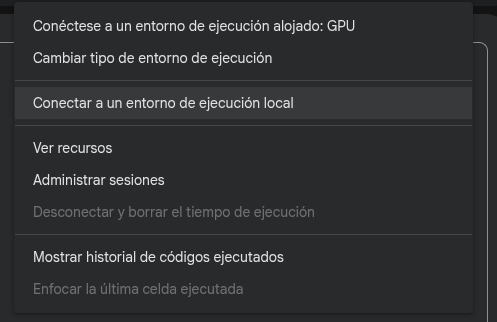
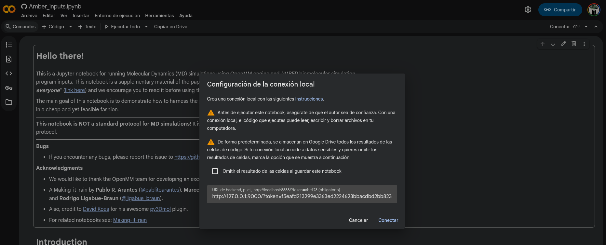
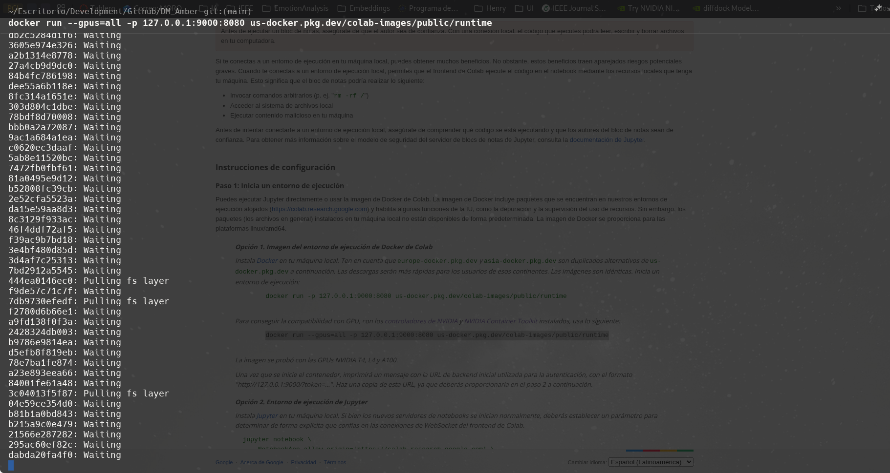
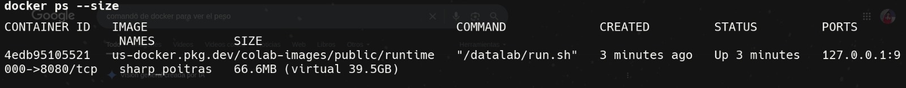
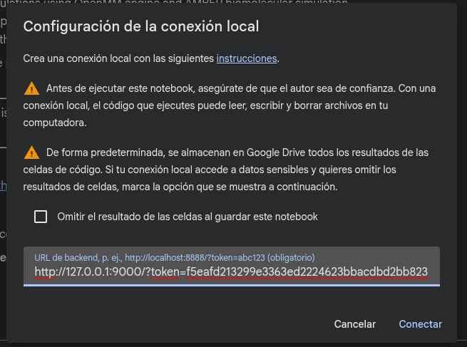
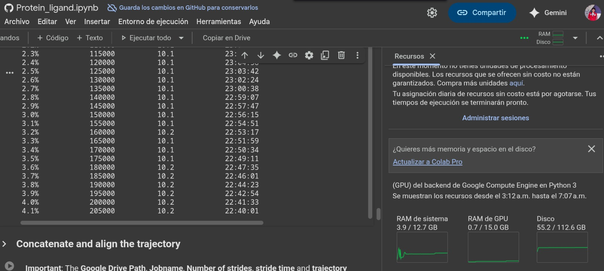

## Método 1: Conectar desde Google Colab (Recomendado)
En este caso solo tendra que ejecutar el siguiente bloque de código en una celda de Google Colab para conectarse a su contenedor Docker.

### Requisitos Previos
- Tener Docker instalado y en ejecución en su máquina local.
- Tener Google Colab abierto en su navegador.

### Paso a Paso
#### 1. Abra una nueva libreta en Google Colab.
##  
Nota: Seccion de escojer tipo de entorno de ejecucion
##  
Nota: Seccion ha colocar dirreccion del servidor


#### 2. Copie y pegue el siguiente código en una terminal:
La primera ves que lo ejecute, descargará la imagen de Docker necesaria suele tardar casi 1h en estar lista. Las siguientes veces, simplemente creara uno desde cero pero sera inmediato.
```bash
docker run --gpus=all -p 127.0.0.1:9000:8080 us-docker.pkg.dev/colab-images/public/runtime
```
##  
Nota: La primera ves que lo ejecute, descargará la imagen de Docker necesaria suele tardar casi 1h en estar lista. Las siguientes veces, simplemente creara uno desde cero pero sera inmediato. 

#### 2. Colocar la ip que retorna el contenedor al terminar de levantarlo en la seccion de "Dirección del servidor" en Google Colab.:

##  
Nota: Copia el link que se ve al final en la consola

##  
Nota: Solo hay que colocar el ruta retornada es una dirrecion por lo general en el formato: http://127.0.0.1:9000/?token=xxxxxxxxxxxxxxxxxxxxxxxxxxxxxxxxxxxxxxxxxxxxxxxxxxxxxxxxxxxxxx

##  
Nota: Aqui ya se veria el ambiente conectado


> [!NOTE]
> En mi caso hacer este metodo solo me permitia crear una secion por computador y no podia tener varias seciones en diferentes contendores de docker.

